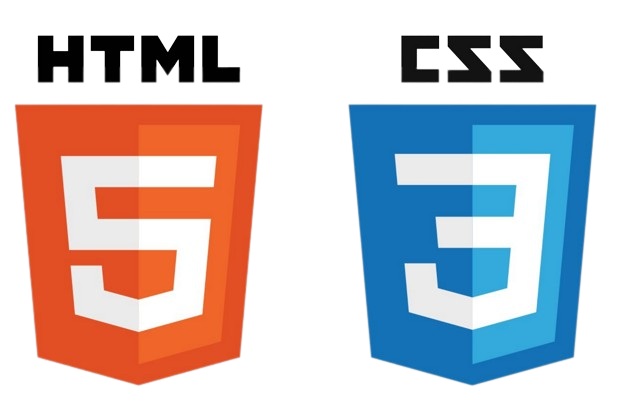
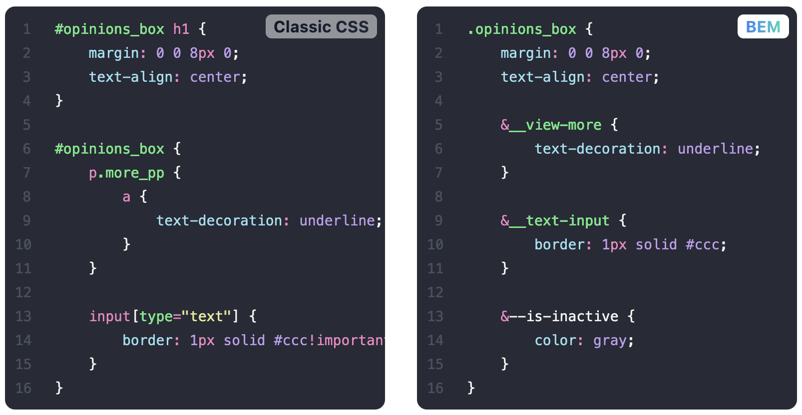

<script src="https://cdn.tailwindcss.com/3.0.0"></script>
<script>tailwind.config = { corePlugins: { preflight: false } }</script>

<!--

no title
purpose was to deliver the best new technology
however we are talking about css and how it became great
or how it can be great if we use it correctly
blog post by Adam Wathan

=> our tech stack, how we started
-->

<style scoped>
.author-bio {
  background-color: rgba(205,200,250,1);
  border-radius: 40px;
}
.author-bio__image {
  width: 70%;
  height: auto;

}
.author-bio__content {
  padding: 1rem;
}
.author-bio__name {
  font-size: 1.25rem;
}
.author-bio__body {
  font-size: 1rem;
  line-height: 1.5;
}
</style>
<section class="flex justify-center">
<div class="author-bio pt-4">
  
  <div class="author-bio__content">
    <h2 class="author-bio__name">João Barreiros</h2>
    <p class="author-bio__body">I'm awesome!</p>
  </div>
</div>
</section>

---




<!--
When I first learned css I was taught to separate
I had never used
-->
---

# Separation of concerns

<div class="invisible">a</div>
<div class="invisible">a</div>
<div class="invisible">a</div>
<div class="invisible">a</div>
<div class="invisible">a</div>
<div class="invisible">a</div>
<div class="invisible">a</div>
<div class="invisible">a</div>
<div class="invisible">a</div>


---

<style scoped>
pre {
  font-size: 20px;
}
</style>

```html
<div class="author-bio">
  
  <div>
    <h2>João Barreiros</h2>
    <p>I'm awesome!</p>
  </div>
</div>
```

```css
.author-bio {
  background-color: rgba(205,200,250,1);
  border-radius: 40px;
  > img {
    width: 70%;
    height: auto;
  }
  > div {
    padding: 1rem;
    > h2 {
      font-size: 1.25rem;
    }
    > p {
      font-size: 1rem;
      line-height: 1.5;
    }
  }
}
```

<!--
I had "separated my concerns", but there was still a very obvious coupling between my CSS and my HTML.
Most of the time my CSS was like a mirror for my markup; perfectly reflecting my HTML structure with nested CSS selectors.
-->

---
<style scoped>
blockquote {
  font-size: 35px;
}
</style>

> My markup wasn't concerned with styling decisions, but my CSS was <span class="underline decoration-wavy decoration-rose-500 underline-offset-8">very concerned</span> with my markup structure.
---

<span class="bg-clip-text text-transparent bg-gradient-to-r from-blue-500 to-teal-400">BEM</span><span> — is a methodology that helps you to create reusable components and code sharing in front‑end development<span>



<!--
Blocks, Elements and Modifiers

Easy:
To use BEM, you only need to employ BEM’s naming convention.

Modular:
Independent blocks and CSS selectors make your code reusable and modular.

Flexible:
Using BEM, methodologies and tools can be recomposed and configured the way you like.
-->

---

<style scoped>
pre {
  font-size: 20px;
}
</style>

```html
<div class="author-bio">
  
  <div class="author-bio__content">
    <h2 class="author-bio__name">João Barreiros</h2>
    <p class="author-bio__body">I'm awesome!</p>
  </div>
</div>
```

```css
.author-bio {
  background-color: white;
}
.author-bio__image {
  display: block;
  width: 100%;
  height: auto;
}
.author-bio__content {
  padding: 1rem;
}
.author-bio__name {
  font-size: 1.25rem;
}
.author-bio__body {
  font-size: 1rem;
  line-height: 1.5;
}
```

<!--
This felt like a huge improvement to me. My markup was still "semantic" and didn't contain any styling decisions, and now my CSS felt decoupled from my markup structure, with the added bonus of avoiding unnecessary selector specificity.

=> But then I ran into a dilemma. (similar components)
-->

---

<div class="flex justify-center gap-8">
<section class="flex justify-center">
<div class="author-bio pt-4 max-w-lg">
  
  <div class="author-bio__content">
    <h2 class="author-bio__name">João Barreiros</h2>
    <p class="author-bio__body">I'm awesome!</p>
  </div>
</div>
</section>
<section class="flex justify-center max-w-lg">
<div class="author-bio pt-4">
  
  <div class="author-bio__content">
    <h2 class="author-bio__name">AI is Taking Over</h2>
    <p class="author-bio__body">The Hidden Truth About Your AI Personal Assistant...</p>
  </div>
</div>
</section>
</div>

<style scoped>
.author-bio {
  background-color: rgba(205,200,250,1);
  border-radius: 40px;
}
.author-bio__image {
  width: 60%;
  height: auto;

}
.author-bio__content {
  padding: 1rem;
}
.author-bio__name {
  font-size: 1.25rem;
}
.author-bio__body {
  font-size: .8rem;
  line-height: 1.5;
}
</style>

<!--
here we have 2 options (duplicate, abstract)
-->

---

```css
.article {
  background-color: white;
}
.article__image {
  display: block;
  width: 100%;
  height: auto;
}
.article__content {
  padding: 1rem;
}
.article__name {
  font-size: 1.25rem;
}
.article__body {
  font-size: 1rem;
  line-height: 1.5;
}
```

<!--

This works but of course it's not very DRY. It also makes it a bit too easy for these components to differ in slightly different ways (maybe a different padding, or font color) which can lead to an inconsistent looking design.

Our .author-bio and .article-preview components have nothing in common from a "semantic" perspective. One is the bio of an author, the other is a preview of an article.
But as we've already seen, they have a lot in common from a design perspective.
So if we wanted to, we could create a new component named after what they do have in common, and reuse that component for both types of content.
-->

---

```css
.media-card {
  background-color: white;
}
.media-card__image {
  display: block;
  width: 100%;
  height: auto;
}
.media-card__content {
  padding: 1rem;
}
.media-card__name {
  font-size: 1.25rem;
}
.media-card__body {
  font-size: 1rem;
  line-height: 1.5;
}
```

---

**This approach also removes the duplication from our CSS, but aren't we <span class="underline decoration-wavy decoration-fuchsia-500 underline-offset-8">"mixing concerns"</span> now?**

<div class="invisible">a</div>


<!--
Our markup all of a sudden knows that we want both of these pieces of content to be styled as media cards. What if we wanted to change how the author bio looked without changing how the article preview looks?

meaning that the css can no longer change style of components with different semantics
-->

---

> Before, we could just open up our stylesheet and choose new styles for either of the two components. Now we'd need to edit the HTML! <span class="underline decoration-wavy decoration-sky-500 underline-offset-8">**Blasphemy!**</span>

---

**You either have separation of concerns (<span class="underline decoration-wavy decoration-emerald-500 underline-offset-8">good!</span>), or you don't (<span class="underline decoration-wavy decoration-rose-500 underline-offset-8">bad!</span>).**

---

<style scoped>
  li {
    font-size: .8em;
  }
</style>

*"Separation of Concerns"*

**CSS that depends on HTML.**

<div class="invisible">a</div>

- Naming your classes based on your content (like `.author-bio`).
- The HTML is independent;
- Your CSS on the other hand is not independent;

<div class="invisible">a</div>

> In this model, your HTML is <span class="underline decoration-wavy decoration-violet-400 underline-offset-8">restyleable</span>, but your CSS is not <span class="underline decoration-wavy decoration-lime-400 underline-offset-8">reusable</span>.

<!--
html: doesn't care how you make it look, it just exposes hooks like .author-bio that the HTML controls.
css: needs to know what classes your HTML has decided to expose, and it needs to target those classes to style the HTML.
-->

---
<style scoped>
  li {
    font-size: .8em;
  }
</style>

*"Mixing Concerns"*

**HTML that depends on CSS.**

<div class="invisible">a</div>

- Naming your classes in a content-agnostic way after the repeating patterns in your UI (like `.media-card`)
- The CSS is independent;
- Your HTML is not independent;

<div class="invisible">a</div>

> In this model, your CSS is <span class="underline decoration-wavy decoration-lime-400 underline-offset-8">reusable</span>, but your HTML is not <span class="underline decoration-wavy decoration-violet-400 underline-offset-8">restyleable</span>.

<!--
treats your CSS as a dependency of your HTML.
CSS: doesn't care what content it's being applied to, it just exposes a set of building blocks that you can apply to your markup.
HTML: making use of classes that have been provided by the CSS, and it needs to know what classes exist so that it combine them however it needs to to achieve the desired design.

Neither is inherently "wrong"; it's just a decision made based on what's more important to you in a specific context.
-->
---

<style scoped>
  code {
    font-size: .7em;
  }
</style>

### Choosing reusability

- `.card`
- `.btn`, `.btn--primary`, `.btn--secondary`
- `.badge`
- `.card-list`, `.card-list-item`
- `.img--round`
- `.modal-form`, `.modal-form-section`


---

> The more a component does, or the more specific a component is, the <span class="underline decoration-wavy decoration-rose-500 underline-offset-8">harder</span> it is to reuse.

---

<style scoped>
  code {
    font-size: .7em;
  }
</style>

### Composition over duplication

- `actions-list align-left`
- `actions-list__item btn btn--secondary`
- `.card-list`, `.card-list-item`
- `.img--round`
- `.modal-form`, `.modal-form-section`

<!--
So if we had two actions lists, one that needed to be left aligned and another that needed to be right aligned, how could we solve that problem with composition?
-->

---
### Utility classes

- Text sizes, colors, and weights
- Border colors, widths, and positions
- Background colors
- Flexbox utilities
- Padding and margin helpers

<!--
naming thing is one of the most difficult jobs for a dev (all utilities are already named)
-->

---

```html
<button
  class="bg-blue-500 hover:bg-blue-700 text-white
         font-bold py-4 px-8 rounded-full text-3xl"
>
  Button
</button>
```

<div>
<button class="bg-blue-500 hover:bg-blue-700 text-white font-bold py-4 px-8 rounded-full text-3xl">
  Button
</button>
</div>

---


- fewer class names
- less code
- write code faster
- purging of unnecessary styles

<!--
responsiveness
pseudo-classes
dark mode
animations
World-class IDE integration
-->

---

## Challenge time!
---

<style scoped>
  .a {
    background-color: Violet;
  }
  /* .b {
    background-color: LightSkyBlue;
  } */
</style>

```html
<style>
.a {
  background-color: Violet;
}
/* .b {
  background-color: LightSkyBlue;
} */
</style>

<div class="a b">A -> B</div>
<div class="b a">B -> a</div>
```

<div>
  <div class="a b">A -> B</div>
  <div class="b a">B -> a</div>
</div>

---
<style scoped>
  .a {
    background-color: Violet;
  }
  .b {
    background-color: LightSkyBlue;
  }
</style>

```html
<style>
.a {
  background-color: Violet;
}
.b {
  background-color: LightSkyBlue;
}
</style>

<div class="a b">A -> B</div>
<div class="b a">B -> a</div>
```

<div>
  <div class="a b">A -> B</div>
  <div class="b a">B -> a</div>
</div>

---

but doesn't Chakra UI do the same thing?

<!--
you can only style chakraui components and you style them with props
I have noticed that not all components accept all styling props
-->

---

### Can you use both?

> Yes you can definitely use Chakra with Tailwind since it's just a bunch of class names you need to add.
>
> Yes, Chakra's theme is inspired by Tailwind so you should be pretty good and most of Chakra's styling props should feel relatable.
>
> Give it a try and let me know what you think.

<!--
when you use a component it's already styled for you
i would say that a lot of apps that use this library might look similar
some styles might be hard to override

is there any alternative
-->

---


> A library of completely unstyled, fully accessible UI components, designed to pair perfectly with Tailwind CSS.

---

**So, do you still have any <span class="underline decoration-wavy decoration-rose-400 underline-offset-8">~~concerns~~</span>? I mean questions?**

---

## References

CSS Utility Classes and "Separation of Concerns" - by Adam Wathan
<https://adamwathan.me/css-utility-classes-and-separation-of-concerns/>

Tailwind CSS is the worst… - by Fireship
<https://www.youtube.com/watch?v=lHZwlzOUOZ4>

---

## Frameworks

Tailwindcss
<https://tailwindcss.com/>

Headless UI
<https://headlessui.com/>

---

## Tools

Visual Studio Code
<https://code.visualstudio.com>

Marp - Create slides with Markdown
<https://marp.app>

<!--
# Topics

- talk about how speparation of concerns is/unsed to be the norm
- show normal hmtl -> transition to bem
- dealing with similar components (duplicate or generalize)
  - Blasphemy
- Choosing reusability
  - > The more a component does, or the more specific a component is, the harder it is to reuse.
  - Phase 3: Content-agnostic CSS components
    - Composition over subcomponents
  - Phase 4: Content-agnostic components + utility classes
  - Phase 5: Utility-first CSS
    - naming thing is one of the most difficult jobs for a dev (all utilities are already named)
- challenge: classes order in styles and html

-->